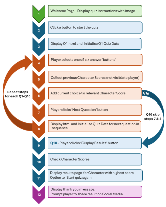

# Mad Hatter's Personality Quiz

The Mad Hatter's Personality Quiz is a fun way to see which character from Alice in Wonderland you are most similar to.

The adventures of Alice in Wonderland are well known and loved around the World. The larger than life characters and bizarre situations have inspired movies and songs, and influenced pop culture for almost 160 years. 

This quiz will take the user on their own personal journey through Wonderland and will compare their own personality traits with 6 of the best known characters that Lewis Carrol first created in 1865.

## Features

### Site Wide

***Favicon***
- A favicon of the recognisable hat of the Mad Hatter so it is easily identifiable among multiple tabs.

***Navigation Menu***
- Makes it easy for the user to move back to the welcome page and start the quiz again if they wish. 
- Responsive design to work across devices of different sizes.

***Footer***

- Contains links to Github and LinkedIn profiles for the quiz creator; Sophie Thomson.
- These links open in a new tab and include accessibillity conventions such as aria labels.

### Welcome Page (index.html)

***Hero Image***

- Clearly recognisable image of a table laden with the kinds of items you would expect to find at the Mad Hatter's Tea Party.
- Image chosen and sized to work well with adjusted focus on different device sizes.

***Intro Text***
- Introduction to the quiz, setting the scene and transporting user into the world of Alice in Wonderland
- Clear concise instructions on how to complete the quiz and what you can expect at the end.

***Start Quiz Button***

- A button at the bottom of the page inviting the user to 'Enter the Rabbit Hole...' and start their quiz.
- This button will navigate to the Question One page and initialise the data for the first question.

### Questions Page (questions.html)

***Image***

- Image relating to the nature of the question with a reference to Alice in Wonderland.
- Image selected to work well on different device sizes.
- css and media queries used to ensure image is responsive and looks good on different device sizes.

***Question***

- Heading 2 level styling used to make the question stand out at the top of the page and follow assessibility guidelines.

***Answer Options***

 - A choice of 6 different fun answers for the user to select from.
 - When the user moves their mouse over an answer the colour changes to highlight the option they would select if they clicked on that option. This does not happen on mobile devices and tablets unless they use a stylus.
 - When an answer has been chosen (clicked on), the selected answer changes background colour and has a contrasting outline border. 
 - Each answer has an assigned value for a particular character from Alice in Wonderland. 
 - When an answer is selected, the character value of the chosen option is added to a score for that particular character.
 - The character score board is not visible to the user, but is used in the JavaScript to keep a tally of the scores from one question to the next.
 - There are 6 different characters or personality types that the user can be given based on their final score, so each character is assigned to only one answer on each question page.

***Next Question Button***

- A button at the bottom of the page inviting the user to progress to the next question in the quiz.
- This button will navigate to the next question page in the sequence.  

### Question 10 Page (q10.html)

***Image***

- Image relating to the nature of the question with a reference to Alice in Wonderland.
- Image selected to work well on different device sizes.
- css and media queries used to ensure image is responsive and looks good on different device sizes.

***Question***

- Heading 1 level styling used to make the question stand out as the most important thing on the page and follow assessibility guidelines.

***Answer Options***

 - A choice of 6 different fun answers for the user to select from.
 - When the user moves their mouse over an answer the colour changes to highlight the option they would select if they clicked on that option. This does not happen on mobile devices and tablets unless they use a stylus.
 - When an answer has been chosen (clicked on), the selected answer changes background colour and has a contrasting outline border. 
 - Each answer has an assigned value for a particular character from Alice in Wonderland. 
 - When an answer is selected, the character value of the chosen option is added to a score for that particular character.
 - The character score board is not visible to the user, but is used in the JavaScript to keep a tally of the scores from one question to the next.
 - There are 6 different characters or personality types that the user can be given based on their final score, so each character is assigned to only one answer on each question page.

***Results Button***

- A button at the bottom of the page inviting the user to see which character they are most similar to.
- This button will have an event listener to trigger a set of functions to see which character has the highest score
- Each character has a results page

### Character Result Pages (mad-hatter.html, alice.html, cheshire-cat.html, white-rabbit.html, queen-of-hearts.html, blue-caterpillar.html)

***Image***

- Image relating to the nature of the question with a reference to Alice in Wonderland.
- Image selected to work well on different device sizes.
- css and media queries used to ensure image is responsive and looks good on different device sizes.

***Description***

- A brief descrpition of the characteristics that make you like your character.

***Repeat Quiz Button***

- A button inviting the user to take the quiz again and see who they get next time.

***Share Results Button????***

### 404 Error Page (404.html)

- Branded 404 error page with button so the user can easily navigate back to the welcome page.
- Same site-wide styling as other pages to improve user experience and consistency.

### Existing Features

- Responsive hompepage with effective styling to look good on different sized devices.
- Responsive header and footer with hidden elements to improve appearance on smaller devices.

### Additional Features to Implement
To expand on this site, there are a number of features that could be added to provide additional information and functionality:
- A button inviting the user to share their quiz results on their social media profile.
- The option to download a recipe for an item to take to the Mad Hatter's Tea Party relating to their character.
 
## Design

### Planning Process

***Mind Mapping***

- A visual mindmap was used to map out the different elements needed to create the initial structure of the site.

***Psuedo Code***

- An initial flow diagram was created to show a simplified sequence of steps that the site will follow in response to user actions.
- Each of the inital steps is then broken down into a subset of smaller psuedo code blocks which can then be translated into JavaScript syntax.

***Questions and Answers***

- A spreadsheet was created to list 10 personality related questions.
- Each question was given 6 possible answer options which relate to the characters created in the book.
- Each answer option was assigned a character value for one of 6 Alice in Wonderland characters: 
    - Alice
    - White Rabbit
    - Mad Hatter
    - Cheshire Cat
    - Blue Caterpillar
    - Queen of Hearts

### Responsive Layout

## Testing

### Links

***Method of Testing***

***Results***

### Responsiveness
Each page has been tested for responsive design on devices ranging from a minimum of 280px wide (Galaxy Fold), larger mobiles of 320, 350px and 425px and for tablets of 768px, laptops at 1024px and larger desktop screens.

***Method of Testing***

Once deployed in Github, each page has been viewed at each of the above marked out sizes within Google Developer Tools, and by clicking and dragging the screen size to the smallest and largest sizes.

To access Google Developer Tools:
- Click on Google menu (three dots in top left corner)
- Select 'More tools'
- Select '<> Developer tools'
- Opens the current page in an adaptive window where you can change size of device by clicking in different spaces in the top border above the screen preview

***Results***

### Form Inputs

***Method of Testing***

***Results***

### Validator Testing

- HTML
    - No errors were returned when passing through the official [W3C validator](https://validator.w3.org/) 
    - Full screenshots available in docs folder.

- CSS
    - No errors were found when passing through the official [(Jigsaw) validator](https://jigsaw.w3.org/css-validator/)

- Lighthouse Testing
    - Good scores achieved for all pages. Full screenshots available in docs folder.

### Unfixed Bugs

## Deployment

### Gitpod Version Control
This site was created using the Gitpod cloud development environment before being pushed through to a dedicated repository on Github.

The following commands were used througout development to push the code through to the Github repo:

- **git add .** - This command was used to add any tracked files to the staging area.
- **git commit -m "Commit message."** - This command was used to create a snapshot of the staged area with a short description.
- **git push** - This command was used to push the committed changes from the current branch to the remote repository on Github.

### Deployment

- The site was deployed to GitHub pages. The steps to deploy are as follows: 
  - In the GitHub repository, navigate to the Settings tab
  - Select Pages link in the left hand menu 
  - From the source section drop-down menu, select the Main Branch
  - Click 'Save'
  - Once the main branch has been selected, the page will be automatically refreshed with a detailed ribbon display to indicate the successful deployment. 

The live link can be found here 

## Credits

### Content

***JavaScript***
- Code from [StackOverflow] (https://stackoverflow.com/questions/69743873/continuous-rainbow-color-cycling-effect-in-js) was adapted to create colour changing effect on main heading element.

- 

### Media
- Welcome Page Hero Image downloaded from [Adobe Stock](https://stock.adobe.com/images/mad-hatter-s-tea-party-whimsical-wonderland-table/751113710)
- 

## Code & Technology
 The following code, platforms and apps were used in the creation of this site:
 - HTML - The main language used to build the content of the webpages.
 - CSS - CSS styling is applied to all areas of the website from within an external file.
 - JS - Javascript code is applied throughout the site to enable interactive feedback with the user in response to their actions.
 - Gitpod - Cloud development environment used to write and preview code before committing.
 - Github - Github hosts the Mad Hatter's Personality Quiz repository and is where the site is deployed.
 - Font Awesome - Free icons from font awesome are used in the footer and on a button. 
 - Convertio.co - To improve performace, all jpg images were converted to webp using [convertio.co](https://convertio.co/jpeg-webp/).
 - Tinypng - To further reduce the size of images they were 'tinified' using [TinyPNG](https://tinypng.com/).
 - Favicon.io - The Mad Hatter's Personality Quiz favicon was generated using [Favicon.io](https://favicon.io/favicon-converter/) free generator.
 - Balsamiq - The responsive layout wireframes were designed and planned using [Balsamiq](https://balsamiq.com/).
 - FreeMind - The initial mindmapping process to plan out the various elements of the project was created using [FreeMind] (https://sourceforge.net/projects/freemind/) open source software.