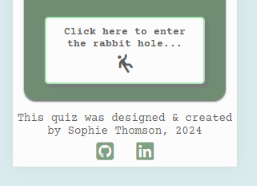

# Mad Hatter's Personality Quiz

The Mad Hatter's Personality Quiz is a fun way to see which character from Alice in Wonderland you are most similar to.

The adventures of Alice in Wonderland are well known and loved around the World. The larger than life characters and bizarre situations have inspired movies and songs, and influenced pop culture for almost 160 years. 

This quiz will take the user on their own personal journey through Wonderland and will compare their own personality traits with 6 of the best known characters that Lewis Carrol first created in 1865.

The live site can be found here: https://sophie-thomson.github.io/mad-hatters-personality-quiz/

## Features

### Site Wide

***Favicon***
- A favicon of the recognisable hat of the Mad Hatter so it is easily identifiable among multiple tabs.

***Logo and Mad Hatter's Personality Quiz Heading***
- Logo and h1 text for Mad Hatter's Personality Quiz visible on every page of the site.
- JS used to continually change the colour of the heading reflecting the Mad Hatter personality. 
- Link to index.html from h1 and logo makes it easy for the user to move back to the welcome page and re-start the quiz if they wish. 
- Responsive design to work across devices of different sizes.

***Footer***

- Information on the creator of the quiz; Sophie Thomson.
- Contains links to Github and LinkedIn profiles for Sophie Thomson.
- Uses Fontawesome icons for GitHub and LinkedIn.
- These links open in a new tab and include accessibillity conventions such as aria labels.

### Welcome Page (index.html)

***Hero Image***

- Clearly recognisable image of a table laden with the kinds of items you would expect to find at the Mad Hatter's Tea Party.
- Image chosen and sized to work well with adjusted focus on different device sizes.

***Intro Text***
- Introduction to the quiz, setting the scene and transporting user into the world of Alice in Wonderland
- Clear concise instructions on how to complete the quiz and what you can expect at the end.

***How to Play Button***
- Button for user to click on and see a set of clear and concise instructions on how the quiz will work.
- JS used to trigger a pop-up modal with the instructions and a 'x' to close the modal.
- Clicking anywhere on the screen outside of the modal also closes the modal.

***Start Quiz Button***

- A button at the bottom of the page inviting the user to 'Enter the Rabbit Hole...' and start their quiz.
- This button navigates to the Question One page and initialises the data for the first question.

***Welcome Page Wireframes***

### Questions Page (Q1-9) (questions.html)

***Image***

- Image relating to the nature of the question with a reference to Alice in Wonderland.
- Image selected to work well on different device sizes.
- css and media queries used to ensure image is responsive and looks good on different device sizes.

***Question***

- Heading 2 level styling used to make the question stand out at the top of the page and follow assessibility guidelines.

***Answers and Scores***

 - A choice of 6 different fun answers for the user to select from.
 - When the user moves their mouse over an answer the colour changes to highlight the option they would select if they clicked on that option. This does not happen on mobile devices and tablets unless they use a stylus.
 - When an answer has been chosen (clicked on), the selected answer changes background colour and has a contrasting outline border and all other answers are disabled. 
 - Each answer has been assigned an array of scores relating to each of 6 characters (personalities) from Alice in Wonderland [0, 0, 0, 0, 0, 0].
 - The index of the selected answer score matches index of Alice in Wonderland characters: [Alice, Mad Hatter, White Rabbit, Cheshire Cat, Blue Caterpillar, Queen of Hearts]
 - A score of 3 points is given to the character with the closest personality alignment to the answer, 2 points are given to the next closest, and 1 point to a character with a small connection. The other three characters are given a score of 0 for that answer.

***Next Question Button***

- Located below the answer buttons, this button invites the user to progress to the next question in the quiz.
- Only visible once the user has selected an enswer to ensure that they answer all 10 questions.
- When the user clicks the next question button, this triggers the addScore function which adds the scores of the current answer to the character scoreboard for all characters.
- The character score board is not visible to the user, but is used in the JavaScript to keep a tally of the scores from one question to the next.
- The addScore function then calls the nextQuestion function to replace the current question and answer data with the next set of data in the sequence.
-  

***Change Answer Button***

- A button at the bottom of the page inviting the user to change their chosen answer before moving on to the next question.
- This improves user experience so that they don't have to go back to the beginning of the quiz if they change their mind or click the wrong thing by accident.
- This button triggers the changeAnswer function which resets the current question data, effectively allowing the user to choose a different answer.

***Question Page Wireframes***

### Final Question (Q.10)

***Image***

- Image relating to the nature of the question with a reference to Alice in Wonderland.
- Image selected to work well on different device sizes.
- css and media queries used to ensure image is responsive and looks good on different device sizes.

***Question***

- Heading 1 level styling used to make the question stand out as the most important thing on the page and follow assessibility guidelines.

***Answers and Scores***

 - A choice of 6 different fun answers for the user to select from.
 - When the user moves their mouse over an answer the colour changes to highlight the option they would select if they clicked on that option. This does not happen on mobile devices and tablets unless they use a stylus.
 - When an answer has been chosen (clicked on), the selected answer changes background colour and has a contrasting outline border. 
 - Each answer has been assigned an array of scores relating to each of 6 characters (personalities) from Alice in Wonderland [0, 0, 0, 0, 0, 0].
 - The index of the selected answer score matches index of Alice in Wonderland characters: [Alice, Mad Hatter, White Rabbit, Cheshire Cat, Blue Caterpillar, Queen of Hearts]
 - When an answer is selected, the scores of the chosen answer are added to a scoreboard for all characters.
 - The character score board is not visible to the user, but is used in the JavaScript to keep a tally of the scores from one question to the next.
 - A score of 3 points is given to the character with the closest personality alignment to the answer, 2 points are given to the next closest, and 1 point to a character with a small connection. The other three characters are given a score of 0 for that answer.

***Results Button***

- A button at the bottom of the final question page inviting the user to see which character they are most similar to.
- An event listener triggers the checkScores function to get the characterScores as an array (60 points in total) e.g [12, 15, 8, 7, 10, 8]
- Using a series of JS functions, the topScore Character and secondScore character are identified and pushed to the results page html.

### Character Result Page (results.html)

***Image***

- Image relating to the nature of the question with a reference to Alice in Wonderland.
- Image selected to work well on different device sizes.
- css and media queries used to ensure image is responsive and looks good on different device sizes.

***Description***

- A brief description of the characteristics that make you like your character.

***Repeat Quiz Button***

- A button inviting the user to take the quiz again and see who they get next time.

***Share Results Button***

- A button has been included which takes the user to Facebook so that they can share the quiz with friends and followers.
- The iframe embedding code from Facebook 

### 404 Error Page (404.html)

- Branded 404 error page with button so the user can easily navigate back to the welcome page.
- Same site-wide styling as other pages to improve user experience and consistency.

### Existing Features

- Responsive hompepage with effective styling to look good on different sized devices.
- Responsive header and footer with hidden elements to improve appearance on smaller devices.

### Additional Features to Implement
To expand on this site, there are a number of features that could be added to provide additional information and functionality:
- A button inviting the user to share their quiz results on their social media profile.
- The option to download a recipe for an item to take to the Mad Hatter's Tea Party relating to their character.
 
## Design

### Planning Process

***Mind Mapping***

- A visual mindmap was used to map out the different elements needed to create the initial structure of the site.

***Psuedo Code***

- An initial flow diagram was created to show a simplified sequence of steps that the site will follow in response to user actions.
- Each of the inital steps is then broken down into a subset of smaller psuedo code blocks which can then be translated into JavaScript syntax.
- Wireframe for each page used to break down main features and psuedo code for the HTML/CSS/JS functions for each feature. 

***Questions and Answers***

- A spreadsheet was created to list 10 personality related questions.
- Each question was given 6 possible answer options which relate to the characters created in the book.
- Each answer option was assigned a score of 3 points, 2 points, or 1 point for the most relevant Alice in Wonderland characters from the below list: 
    - Alice
    - White Rabbit
    - Mad Hatter
    - Cheshire Cat
    - Blue Caterpillar
    - Queen of Hearts

### Responsive Layout

## Testing

### Links

***Method of Testing***

***Results***

### Responsiveness
Each page has been tested for responsive design on devices ranging from a minimum of 280px wide (Galaxy Fold), larger mobiles of 320, 350px and 425px and for tablets of 768px, laptops at 1024px and larger desktop screens.

***Method of Testing***

Once deployed in Github, each page has been viewed at each of the above marked out sizes within Google Developer Tools, and by clicking and dragging the screen size to the smallest and largest sizes.

To access Google Developer Tools:
- Click on Google menu (three dots in top left corner)
- Select 'More tools'
- Select '<> Developer tools'
- Opens the current page in an adaptive window where you can change size of device by clicking in different spaces in the top border above the screen preview

***Results***

### Form Inputs

***Method of Testing***

***Results***

### Validator Testing

- HTML
    - No errors were returned when passing through the official [W3C validator](https://validator.w3.org/) 
    - Full screenshots available in docs folder.

- CSS
    - No errors were found when passing through the official [(Jigsaw) validator](https://jigsaw.w3.org/css-validator/)

- Lighthouse Testing
    - Good scores achieved for all pages. Full screenshots available in docs folder.

### Unfixed Bugs

## Deployment

### Gitpod Version Control
This site was created using the Gitpod cloud development environment before being pushed through to a dedicated repository on Github.

The following commands were used througout development to push the code through to the Github repo:

- **git add .** - This command was used to add any tracked files to the staging area.
- **git commit -m "Commit message."** - This command was used to create a snapshot of the staged area with a short description.
- **git push** - This command was used to push the committed changes from the current branch to the remote repository on Github.

### Deployment

- The site was deployed to GitHub pages. The steps to deploy are as follows: 
  - In the GitHub repository, navigate to the Settings tab
  - Select Pages link in the left hand menu 
  - From the source section drop-down menu, select the Main Branch
  - Click 'Save'
  - Once the main branch has been selected, the page will be automatically refreshed with a detailed ribbon display to indicate the successful deployment.  

## Credits

### Content

***Logic & Approach***

- [The Travel Personality Quiz Project](https://github.com/emmahewson/mp2_travel_quiz/tree/main) by Emma Hewson was referred to for guidance on:
    - managing multiple scores for an array of characters
    - comparing chosen answer data to questions and ansers dataset
    - types of functions that may be required

No code was taken from Emma's project, but it was useful for planning logical process and as a prompt for what might come next when I got stuck. 

***JavaScript***

- Code from [StackOverflow] (https://stackoverflow.com/questions/69743873/continuous-rainbow-color-cycling-effect-in-js) was adapted to create colour changing effect on main heading element.
- A tutorial on [w3Schools.com] (https://www.w3schools.com/howto/howto_css_modals.asp) was used to create and style a pop-up instructions modal on the welcome page.
- A tutorial How to Make Quiz App Using JavaScript on [GreatStack] (https://www.youtube.com/watch?v=PBcqGxrr9g8) was referred to for 
    - structuring the questions & answers datasets
    - code for building questions and creating answer buttons
    - code for while loop removing previous answer buttons
    - code to target chosen answer
    - code logic required to reset state of the page ready to build next question
- Code for using .map(Number) adapted from [StackOverflow discussion](https://stackoverflow.com/questions/48343478/what-does-mapnumber-do-here#:~:text=map(Number)%20%2F%2F%20Calls%20Number,ever%20is%20passed%20to%20it)
- Code from a discussion on [StackOverflow](https://stackoverflow.com/questions/31925323/how-to-filter-out-nan-null-0-false-in-an-array-js) was adpated to filter currentScore array to remove all NaN
- Code from the CI Love Maths walkthrough was adapted for for sending and receiving a score to the html DOM
- the syntax for using .push to add items to an array was adapted from examples on [W3Schools tutorial](https://www.w3schools.com/jsref/jsref_push.asp)
- Code to sort an array in descending order adapted from [W3Schools Tutorial](https://www.w3schools.com/js/js_array_sort.asp)
- Syntax for using 'lastIndexOf' to find matching index searching from end of an array found on [Stackoverflow](https://stackoverflow.com/questions/52558924/how-can-i-find-an-array-element-starting-from-the-end-of-the-array)

***Share on Facebook Button***

- Code from the Facebook devlopers pages was used to embed an iframe for users to share their results and a link to the quiz as a post.

EDIT: Unfortunately the embedded code triggered multiple warnings and errors during W3C HTML validation so the automated functionality was removed and the button now links to Facebook which should open up the profile for anyone already logged in to FB.

### Media

***Logo***
- The hat logo was downloaded from [Etsy](https://i.etsystatic.com/43268737/r/il/f5cd85/5522061497/il_794xN.5522061497_dhj8.jpg) 

***Hero Images***

- Welcome Page Hero Image downloaded from [Adobe Stock](https://stock.adobe.com/images/mad-hatter-s-tea-party-whimsical-wonderland-table/751113710)
- Questions Section creative commons Hero Image downloaded from [GoodFon.com](https://www.goodfon.com/films/wallpaper-download-1920x1200-alisa-v-strane-chudes-tim-7375.html)

***Character Results Images***

All character images were found using creative commons filters in Google Chrome:

- Alice image downloaded from [GoodFon.com](https://anime.goodfon.com/art-anime/wallpaper-download-1920x1200-alice-in-wonderland-alice-4136.html)
- Mad Hatter image downloaded from [GoodFon.com](https://www.goodfon.com/films/wallpaper-download-1930x1080-alice-in-wonderland-mad-hatter-bezumnyi-shliapnik-alisa-v-st.html)
- White Rabbit Image dowloaded from [GoodFon](https://www.goodfon.com/films/wallpaper-download-1930x1080-alice-in-wonderland-mad-hatter-bezumnyi-shliapnik-alisa-v-st.html)
- Cheshire Cat image downloaded from [picryl.com](https://picryl.com/media/alice-in-wonderland-1951-cheshire-cat-fb560c)
- Blue Caterpillar image downloaded from [picryl.com](https://picryl.com/media/alice-in-wonderland-1951-caterpillar-df0bf9)
- Queen of Hearts image downloaded from [GoodFon.com](https://www.goodfon.com/films/wallpaper-download-1920x1200-alice-through-the-looking-1639.html)

***Icons***

All icons are downloaded for free from [Font Awesome](https://fontawesome.com/)

### README

- This README was adapted from my own README document for CI PP1 project [Ace Dog Walks](https://github.com/sophie-thomson/ace-dog-walks). That README was created with reference to:
    - CI Love Running README Template
    - The README for [Tacos Travels Project](https://github.com/Gareth-McGirr/tacos-travels) by Gareth McGirr

## Code & Technology
 The following code, platforms and apps were used in the creation of this site:
 - HTML - The main language used to build the content of the webpages.
 - CSS - CSS styling is applied to all areas of the website from within an external file.
 - JS - Javascript code is applied throughout the site to enable interactive feedback with the user in response to their actions.
 - [Stack Overflow](https://stackoverflow.com/) - used as a reference for possible syntax and uses for JS code.
 - [W3 Schools](https://www.w3schools.com/) - used for JS tutorials and testing space to find correct syntax. 
 - Gitpod - Cloud development environment used to write and preview code before committing.
 - Github - Github hosts the Mad Hatter's Personality Quiz repository and is where the site is deployed.
 - Font Awesome - Free icons from font awesome are used in the footer and on a button. 
 - Convertio.co - To improve performace, all jpg images were converted to webp using [convertio.co](https://convertio.co/jpeg-webp/).
 - Tinypng - To further reduce the size of images they were 'tinified' using [TinyPNG](https://tinypng.com/).
 - Favicon.io - The Mad Hatter's Personality Quiz favicon was generated using [Favicon.io](https://favicon.io/favicon-converter/) free generator.
 - Balsamiq - The responsive layout wireframes were designed and planned using [Balsamiq](https://balsamiq.com/).
 - FreeMind - The initial mindmapping process to plan out the various elements of the project was created using [FreeMind] (https://sourceforge.net/projects/freemind/) open source software.
 - Excel (Microsoft Office) - Spreadsheet used to compile questions and answers data and character points values.